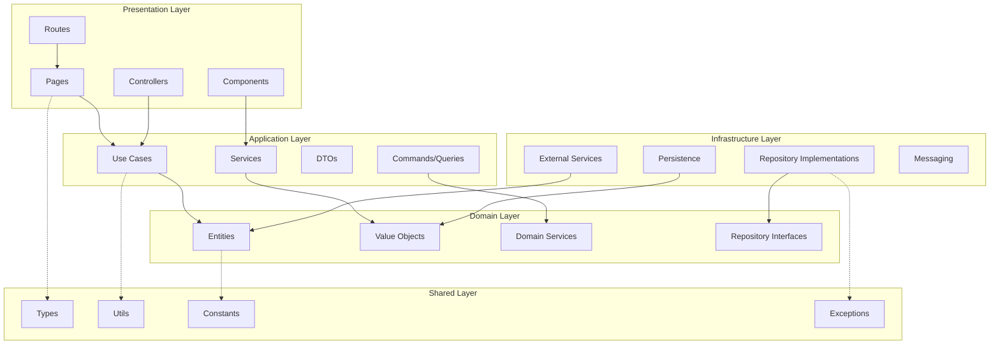

# Design Document

## Overview

本设计文档详细描述了如何将现有的 src/app 目录结构重构为完全符合 DDD 分层架构的结构，实现严格的依赖倒置原则。通过分析现有代码，我们发现项目已经有了基本的 DDD 结构，但存在一些依赖关系违规和结构不完整的问题。

### 当前架构问题分析

1. **依赖关系违规**：shared 层直接依赖 domain 层（如 `contract.types.ts` 导入 domain 的 value-objects）
2. **结构不完整**：某些层缺少 tree.md 中定义的子目录结构
3. **职责混淆**：core 层和 utils 层的功能与标准 DDD 分层重叠
4. **路由分散**：routes 目录独立存在，应该整合到 presentation 层

### 重构目标

- 实现严格的依赖倒置：domain ← application ← presentation，infrastructure → domain
- 完善各层的子目录结构，符合 tree.md 定义
- 清理和重组现有代码，消除依赖违规
- 建立自动化的架构合规性检查机制

## Architecture

### 分层架构图



### 依赖关系规则

1. **Domain Layer**: 不依赖任何其他层，只能使用 shared 层的基础工具
2. **Application Layer**: 只能依赖 domain 层和 shared 层
3. **Infrastructure Layer**: 只能依赖 domain 层和 shared 层，实现 domain 层定义的接口
4. **Presentation Layer**: 只能依赖 application 层和 shared 层
5. **Shared Layer**: 不依赖任何业务层，提供通用功能

## Components and Interfaces

### 1. Domain Layer 重构

#### 目标结构
```
domain/
├── entities/           # 实体和聚合根
├── repositories/       # 仓储接口
├── services/          # 领域服务
├── events/            # 领域事件
├── value-objects/     # 值对象
├── specifications/    # 业务规范
├── factories/         # 工厂
└── policies/          # 业务策略
```

#### 关键接口设计

```typescript
// domain/repositories/contract.repository.interface.ts
export interface ContractRepository {
  save(contract: ContractAggregate): Observable<void>;
  findById(id: string): Observable<ContractAggregate | null>;
  findByCode(code: string): Observable<ContractAggregate | null>;
  delete(id: string): Observable<void>;
  search(criteria: ContractSearchCriteria): Observable<ContractAggregate[]>;
}

// domain/services/contract-domain.service.ts
export interface ContractDomainService {
  validateContract(contract: ContractAggregate): ValidationResult;
  calculateProgress(contract: ContractAggregate): ProgressValue;
  canApprove(contract: ContractAggregate, user: UserEntity): boolean;
}
```

### 2. Application Layer 重构

#### 目标结构
```
application/
├── use-cases/         # 用例实现
├── dto/              # 数据传输对象
├── services/         # 应用服务
├── handlers/         # 事件处理器
├── mappers/          # DTO映射器
├── queries/          # CQRS查询
└── commands/         # CQRS命令
```

#### 用例设计模式

```typescript
// application/use-cases/contract/create-contract.use-case.ts
export class CreateContractUseCase {
  constructor(
    private contractRepository: ContractRepository,
    private contractFactory: ContractFactory,
    private unitOfWork: UnitOfWork
  ) {}

  async execute(dto: CreateContractDto): Promise<ContractResponseDto> {
    // 用例实现逻辑
  }
}
```

### 3. Infrastructure Layer 重构

#### 目标结构
```
infrastructure/
├── persistence/       # 持久化实现
├── external/         # 外部服务
├── messaging/        # 消息处理
├── adapters/         # 适配器
├── security/         # 安全相关
└── config/           # 配置管理
```

#### 仓储实现模式

```typescript
// infrastructure/persistence/repositories/contract.repository.impl.ts
@Injectable()
export class ContractRepositoryImpl implements ContractRepository {
  constructor(private firestore: AngularFirestore) {}

  save(contract: ContractAggregate): Observable<void> {
    // Firestore 实现
  }
}
```

### 4. Presentation Layer 重构

#### 目标结构
```
presentation/
├── pages/            # 页面组件
├── components/       # 可重用组件
├── controllers/      # 控制器
├── middleware/       # 中间件
├── guards/           # 路由守卫
├── interceptors/     # 拦截器
├── validators/       # 验证器
└── routes/           # 路由配置
```

#### 适配器模式增强

```typescript
// presentation/adapters/contract-presentation.adapter.ts
@Injectable()
export class ContractPresentationAdapter {
  constructor(
    private createContractUseCase: CreateContractUseCase,
    private getContractUseCase: GetContractUseCase
  ) {}

  // 只依赖 application 层的用例
}
```

### 5. Shared Layer 重构

#### 目标结构
```
shared/
├── types/            # 通用类型定义
├── utils/            # 工具函数
├── constants/        # 常量定义
├── exceptions/       # 异常类
├── interfaces/       # 通用接口
├── decorators/       # 装饰器
├── pipes/            # 管道
└── filters/          # 过滤器
```

#### 依赖清理策略

```typescript
// shared/types/common.types.ts - 移除对 domain 层的依赖
export interface BaseEntity {
  id: string;
  createdAt: Date;
  updatedAt: Date;
}

// 不再直接导入 domain 层的类型
export type StatusType = 'draft' | 'preparing' | 'active' | 'completed';
export type AmountValue = number;
```

## Data Models

### 领域模型设计

```typescript
// domain/entities/contract/contract.aggregate.ts
export class ContractAggregate extends AggregateRoot {
  private constructor(
    private id: ContractId,
    private code: ContractCode,
    private name: ContractName,
    private status: ContractStatus,
    private amount: Amount,
    private versions: ContractVersion[]
  ) {
    super();
  }

  static create(data: CreateContractData): ContractAggregate {
    // 工厂方法
  }

  approve(approver: UserId): void {
    // 业务逻辑
    this.addDomainEvent(new ContractApprovedEvent(this.id, approver));
  }
}
```

### 数据传输对象设计

```typescript
// application/dto/contract/create-contract.dto.ts
export class CreateContractDto {
  contractCode: string;
  clientName: string;
  contractName: string;
  totalAmount: number;
  description?: string;
}

// application/dto/contract/contract-response.dto.ts
export class ContractResponseDto {
  id: string;
  contractCode: string;
  clientName: string;
  contractName: string;
  status: string;
  totalAmount: number;
  progress: number;
  createdAt: Date;
}
```

## Error Handling

### 分层错误处理策略

```typescript
// shared/exceptions/base.exception.ts
export abstract class BaseException extends Error {
  abstract readonly code: string;
  abstract readonly statusCode: number;
}

// domain/exceptions/contract.exceptions.ts
export class ContractNotFoundError extends BaseException {
  readonly code = 'CONTRACT_NOT_FOUND';
  readonly statusCode = 404;
}

// presentation/filters/global-exception.filter.ts
@Injectable()
export class GlobalExceptionFilter implements ExceptionFilter {
  catch(exception: BaseException, host: ArgumentsHost) {
    // 统一错误处理
  }
}
```

## Testing Strategy

### 测试架构设计

```
tests/
├── unit/              # 单元测试
│   ├── domain/        # 领域层测试
│   ├── application/   # 应用层测试
│   ├── infrastructure/# 基础设施层测试
│   └── presentation/  # 表现层测试
├── integration/       # 集成测试
├── e2e/              # 端到端测试
├── fixtures/         # 测试数据
├── mocks/            # 模拟对象
└── helpers/          # 测试工具
```

### 测试策略

1. **Domain Layer**: 纯单元测试，测试业务逻辑
2. **Application Layer**: 用例测试，使用 mock 仓储
3. **Infrastructure Layer**: 集成测试，测试与外部系统的交互
4. **Presentation Layer**: 组件测试和 E2E 测试

### 依赖注入测试配置

```typescript
// tests/helpers/test-module.helper.ts
export class TestModuleHelper {
  static createTestModule(overrides: any = {}) {
    return {
      providers: [
        { provide: ContractRepository, useClass: MockContractRepository },
        ...overrides
      ]
    };
  }
}
```

## Migration Strategy

### 迁移阶段规划

#### Phase 1: 结构重组
1. 创建完整的目录结构
2. 移动现有文件到正确位置
3. 更新导入路径

#### Phase 2: 依赖清理
1. 识别和修复依赖违规
2. 重构 shared 层，移除对 domain 层的依赖
3. 整合 core 和 utils 功能到相应层

#### Phase 3: 接口标准化
1. 定义标准的仓储接口
2. 实现依赖注入配置
3. 建立事件驱动机制

#### Phase 4: 测试和验证
1. 建立架构合规性检查
2. 完善测试覆盖
3. 性能和功能验证

### 向后兼容性保证

```typescript
// shared/legacy/contract-legacy.adapter.ts
@Injectable()
export class ContractLegacyAdapter {
  // 提供向后兼容的接口
  convertToLegacyFormat(contract: ContractAggregate): LegacyContract {
    // 转换逻辑
  }
}
```

## Architecture Compliance

### 自动化检查工具

```typescript
// scripts/architecture-check.ts
export class ArchitectureChecker {
  checkDependencies(): ArchitectureViolation[] {
    // 检查依赖关系是否符合规范
  }

  checkLayerStructure(): StructureViolation[] {
    // 检查目录结构是否完整
  }
}
```

### ESLint 规则配置

```javascript
// eslint-architecture.config.js
module.exports = {
  rules: {
    'no-restricted-imports': [
      'error',
      {
        patterns: [
          {
            group: ['../../../*'],
            message: 'Cross-layer imports should use absolute paths'
          }
        ]
      }
    ]
  }
};
```

这个设计确保了严格的分层架构和依赖倒置原则的实现，同时提供了完整的迁移策略和质量保证机制。