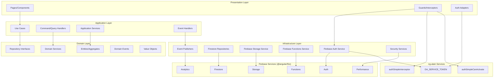

# Design Document

## Overview

本設計文檔詳細描述如何在現有的DDD架構內實現透過@angular/fire與Firebase的完整交互邏輯。基於對當前系統的分析，我們發現項目已經具備了良好的DDD分層架構基礎，並且已經配置了@angular/fire和Firebase服務。本設計將在現有架構基礎上，完善Firebase集成的各個方面，確保符合DDD原則和Angular最佳實踐。

### 當前架構狀態分析

**已完成的部分：**
1. ✅ 完整的DDD分層架構（Domain、Application、Infrastructure、Presentation）
2. ✅ @angular/fire配置完整（Auth、Firestore、Storage、Functions等）
3. ✅ Repository模式實現（ContractFirestoreRepository）
4. ✅ 依賴注入配置完善
5. ✅ 基礎的Firestore操作服務

**需要完善的部分：**
1. 🔄 Firebase認證與ng-alain認證系統的深度整合
2. 🔄 實時數據同步和離線支持的完整實現
3. 🔄 Firebase Security Rules與Domain層權限規則的整合
4. 🔄 完整的錯誤處理和重試機制
5. 🔄 性能監控和優化機制
6. 🔄 測試策略的完善

### 設計目標

- 在現有DDD架構基礎上完善Firebase集成
- 確保所有Firebase操作都通過@angular/fire進行
- 實現統一的認證和授權機制
- 提供高效的實時數據同步
- 建立完整的錯誤處理和監控體系

## Architecture

### 整體架構圖



### Firebase集成分層設計

#### 1. Domain Layer - 純業務邏輯
```typescript
// 不直接依賴Firebase，只定義業務接口
export interface AuthenticationService {
  authenticate(credentials: UserCredentials): Observable<AuthResult>;
  getCurrentUser(): Observable<User | null>;
  logout(): Observable<void>;
}

export interface ContractRepository {
  save(contract: ContractAggregate): Observable<void>;
  findById(id: string): Observable<ContractAggregate | null>;
  // 其他業務方法...
}
```

#### 2. Application Layer - 用例協調
```typescript
// 使用Domain層接口，不直接依賴Firebase
@Injectable()
export class AuthenticateUserUseCase {
  constructor(
    @Inject(AUTHENTICATION_SERVICE) 
    private authService: AuthenticationService
  ) {}
  
  execute(credentials: UserCredentials): Observable<AuthResult> {
    return this.authService.authenticate(credentials);
  }
}
```

#### 3. Infrastructure Layer - Firebase實現
```typescript
// 實現Domain層接口，使用@angular/fire
@Injectable()
export class FirebaseAuthenticationService implements AuthenticationService {
  constructor(
    private afAuth: Auth,
    private firestore: Firestore
  ) {}
  
  authenticate(credentials: UserCredentials): Observable<AuthResult> {
    return from(signInWithEmailAndPassword(
      this.afAuth, 
      credentials.email, 
      credentials.password
    )).pipe(
      map(userCredential => this.mapToAuthResult(userCredential))
    );
  }
}
```

#### 4. Presentation Layer - UI適配
```typescript
// 只依賴Application層，不直接使用Firebase
@Injectable()
export class AuthPresentationAdapter {
  constructor(
    private authenticateUseCase: AuthenticateUserUseCase,
    private tokenService: DA_SERVICE_TOKEN
  ) {}
  
  login(credentials: LoginDto): Observable<void> {
    return this.authenticateUseCase.execute(credentials).pipe(
      tap(result => this.tokenService.set(result.token))
    );
  }
}
```

## Components and Interfaces

### 1. 認證系統整合

#### Firebase Auth與ng-alain整合服務
```typescript
// infrastructure/security/firebase-auth-integration.service.ts
@Injectable({
  providedIn: 'root'
})
export class FirebaseAuthIntegrationService {
  constructor(
    private afAuth: Auth,
    @Inject(DA_SERVICE_TOKEN) private tokenService: ITokenService,
    private router: Router
  ) {
    this.initializeAuthStateSync();
  }

  private initializeAuthStateSync(): void {
    // 監聽Firebase Auth狀態變化
    authState(this.afAuth).pipe(
      switchMap(user => {
        if (user) {
          // 用戶已登入，獲取ID Token並同步到ng-alain
          return from(user.getIdToken()).pipe(
            tap(token => this.syncTokenToAlain(token, user))
          );
        } else {
          // 用戶已登出，清除ng-alain token
          this.tokenService.clear();
          return of(null);
        }
      })
    ).subscribe();
  }

  private syncTokenToAlain(token: string, user: User): void {
    const alainToken = {
      token,
      name: user.displayName || user.email,
      email: user.email,
      id: user.uid,
      time: Date.now()
    };
    
    this.tokenService.set(alainToken);
  }

  // 統一登入方法
  async signIn(email: string, password: string): Promise<UserCredential> {
    try {
      const result = await signInWithEmailAndPassword(this.afAuth, email, password);
      // Token同步會自動觸發
      return result;
    } catch (error) {
      throw this.mapFirebaseError(error);
    }
  }

  // 統一登出方法
  async signOut(): Promise<void> {
    await signOut(this.afAuth);
    this.tokenService.clear();
    this.router.navigate(['/passport/login']);
  }

  // 獲取當前用戶
  getCurrentUser(): Observable<User | null> {
    return authState(this.afAuth);
  }

  // 獲取當前ID Token
  getCurrentToken(): Observable<string | null> {
    return authState(this.afAuth).pipe(
      switchMap(user => user ? from(user.getIdToken()) : of(null))
    );
  }

  private mapFirebaseError(error: any): AuthenticationError {
    // 將Firebase錯誤映射為領域異常
    switch (error.code) {
      case 'auth/user-not-found':
        return new UserNotFoundError();
      case 'auth/wrong-password':
        return new InvalidCredentialsError();
      default:
        return new AuthenticationError(error.message);
    }
  }
}
```

#### 增強的HTTP攔截器
```typescript
// infrastructure/security/firebase-auth.interceptor.ts
@Injectable()
export class FirebaseAuthInterceptor implements HttpInterceptor {
  constructor(
    private authService: FirebaseAuthIntegrationService,
    private router: Router
  ) {}

  intercept(req: HttpRequest<any>, next: HttpHandler): Observable<HttpEvent<any>> {
    return this.authService.getCurrentToken().pipe(
      take(1),
      switchMap(token => {
        if (token) {
          // 添加Firebase ID Token到請求頭
          const authReq = req.clone({
            setHeaders: {
              Authorization: `Bearer ${token}`
            }
          });
          return next.handle(authReq);
        }
        return next.handle(req);
      }),
      catchError((error: HttpErrorResponse) => {
        if (error.status === 401) {
          // Token過期，嘗試刷新
          return this.handleTokenRefresh(req, next);
        }
        return throwError(() => error);
      })
    );
  }

  private handleTokenRefresh(req: HttpRequest<any>, next: HttpHandler): Observable<HttpEvent<any>> {
    return this.authService.getCurrentUser().pipe(
      take(1),
      switchMap(user => {
        if (user) {
          // 強制刷新token
          return from(user.getIdToken(true)).pipe(
            switchMap(newToken => {
              const authReq = req.clone({
                setHeaders: {
                  Authorization: `Bearer ${newToken}`
                }
              });
              return next.handle(authReq);
            })
          );
        } else {
          // 用戶未登入，重定向到登入頁
          this.router.navigate(['/passport/login']);
          return throwError(() => new Error('User not authenticated'));
        }
      })
    );
  }
}
```

### 2. 實時數據同步系統

#### Firestore實時監聽服務
```typescript
// infrastructure/persistence/firestore-realtime.service.ts
@Injectable({
  providedIn: 'root'
})
export class FirestoreRealtimeService {
  private subscriptions = new Map<string, Subscription>();

  constructor(private firestore: Firestore) {}

  // 監聽單個文檔變化
  watchDocument<T>(
    collection: string, 
    docId: string,
    mapper: (data: any) => T
  ): Observable<T | null> {
    const docRef = doc(this.firestore, collection, docId);
    
    return docData(docRef, { idField: 'id' }).pipe(
      map(data => data ? mapper(data) : null),
      catchError(error => {
        console.error(`Error watching document ${collection}/${docId}:`, error);
        return of(null);
      })
    );
  }

  // 監聽集合變化
  watchCollection<T>(
    collection: string,
    queryConstraints: QueryConstraint[] = [],
    mapper: (data: any) => T
  ): Observable<T[]> {
    const collectionRef = query(
      collection(this.firestore, collection),
      ...queryConstraints
    );

    return collectionData(collectionRef, { idField: 'id' }).pipe(
      map(docs => docs.map(doc => mapper(doc))),
      catchError(error => {
        console.error(`Error watching collection ${collection}:`, error);
        return of([]);
      })
    );
  }

  // 監聽合同變化（業務特定）
  watchContract(contractId: string): Observable<ContractAggregate | null> {
    return this.watchDocument(
      'contracts',
      contractId,
      (data) => this.mapToContractAggregate(data)
    );
  }

  // 監聽用戶的合同列表
  watchUserContracts(userId: string): Observable<ContractAggregate[]> {
    const constraints = [
      where('createdBy', '==', userId),
      where('isDeleted', '==', false),
      orderBy('createdAt', 'desc')
    ];

    return this.watchCollection(
      'contracts',
      constraints,
      (data) => this.mapToContractAggregate(data)
    );
  }

  // 取消監聽
  unsubscribe(key: string): void {
    const subscription = this.subscriptions.get(key);
    if (subscription) {
      subscription.unsubscribe();
      this.subscriptions.delete(key);
    }
  }

  // 清理所有監聽
  unsubscribeAll(): void {
    this.subscriptions.forEach(subscription => subscription.unsubscribe());
    this.subscriptions.clear();
  }

  private mapToContractAggregate(data: any): ContractAggregate {
    // 使用現有的mapper轉換數據
    // 這裡需要注入ContractMapper
    return new ContractAggregate(/* 映射邏輯 */);
  }
}
```

#### 離線支持服務
```typescript
// infrastructure/persistence/firestore-offline.service.ts
@Injectable({
  providedIn: 'root'
})
export class FirestoreOfflineService {
  constructor(private firestore: Firestore) {
    this.enableOfflineSupport();
  }

  private enableOfflineSupport(): void {
    // 啟用離線持久化
    enableNetwork(this.firestore).catch(error => {
      console.error('Failed to enable network:', error);
    });
  }

  // 檢查網絡狀態
  getNetworkStatus(): Observable<boolean> {
    return new Observable(observer => {
      const unsubscribe = onSnapshot(
        doc(this.firestore, '__network__', 'status'),
        { includeMetadataChanges: true },
        (snapshot) => {
          observer.next(!snapshot.metadata.fromCache);
        },
        (error) => {
          console.error('Network status error:', error);
          observer.next(false);
        }
      );

      return () => unsubscribe();
    });
  }

  // 強制同步離線數據
  async syncOfflineData(): Promise<void> {
    try {
      await enableNetwork(this.firestore);
      console.log('Offline data synced successfully');
    } catch (error) {
      console.error('Failed to sync offline data:', error);
      throw error;
    }
  }

  // 檢查文檔是否來自緩存
  isFromCache(snapshot: DocumentSnapshot): boolean {
    return snapshot.metadata.fromCache;
  }
}
```

### 3. 權限和安全系統

#### Firebase Security Rules整合
```typescript
// infrastructure/security/firebase-security.service.ts
@Injectable({
  providedIn: 'root'
})
export class FirebaseSecurityService {
  constructor(
    private afAuth: Auth,
    private firestore: Firestore
  ) {}

  // 設置用戶自定義聲明
  async setUserClaims(userId: string, claims: Record<string, any>): Promise<void> {
    // 這需要通過Firebase Functions實現
    const setClaimsFunction = httpsCallable(getFunctions(), 'setUserClaims');
    
    try {
      await setClaimsFunction({ userId, claims });
    } catch (error) {
      console.error('Failed to set user claims:', error);
      throw new SecurityError('Failed to update user permissions');
    }
  }

  // 獲取用戶權限
  async getUserClaims(): Promise<Record<string, any>> {
    const user = this.afAuth.currentUser;
    if (!user) {
      throw new AuthenticationError('User not authenticated');
    }

    const idTokenResult = await user.getIdTokenResult();
    return idTokenResult.claims;
  }

  // 檢查用戶是否有特定權限
  async hasPermission(permission: string): Promise<boolean> {
    try {
      const claims = await this.getUserClaims();
      return claims[permission] === true;
    } catch (error) {
      console.error('Failed to check permission:', error);
      return false;
    }
  }

  // 檢查用戶是否有角色
  async hasRole(role: string): Promise<boolean> {
    try {
      const claims = await this.getUserClaims();
      const userRoles = claims['roles'] || [];
      return userRoles.includes(role);
    } catch (error) {
      console.error('Failed to check role:', error);
      return false;
    }
  }

  // 生成安全規則查詢條件
  generateSecurityConstraints(userId: string, userRoles: string[]): QueryConstraint[] {
    const constraints: QueryConstraint[] = [];

    // 基本的用戶訪問控制
    constraints.push(
      or(
        where('createdBy', '==', userId),
        where('assignedTo', 'array-contains', userId),
        where('visibility', '==', 'public')
      )
    );

    // 基於角色的訪問控制
    if (userRoles.includes('admin')) {
      // 管理員可以訪問所有數據
      return [where('isDeleted', '==', false)];
    }

    if (userRoles.includes('manager')) {
      // 經理可以訪問部門數據
      constraints.push(where('department', '==', 'user-department'));
    }

    return constraints;
  }
}
```

### 4. 錯誤處理和重試機制

#### Firebase錯誤處理服務
```typescript
// infrastructure/error-handling/firebase-error.service.ts
@Injectable({
  providedIn: 'root'
})
export class FirebaseErrorService {
  private readonly maxRetries = 3;
  private readonly retryDelay = 1000;

  // 重試操作
  retryOperation<T>(
    operation: () => Observable<T>,
    maxRetries: number = this.maxRetries
  ): Observable<T> {
    return operation().pipe(
      retryWhen(errors =>
        errors.pipe(
          scan((retryCount, error) => {
            if (retryCount >= maxRetries || !this.isRetryableError(error)) {
              throw error;
            }
            return retryCount + 1;
          }, 0),
          delay(this.retryDelay)
        )
      )
    );
  }

  // 判斷錯誤是否可重試
  private isRetryableError(error: any): boolean {
    const retryableCodes = [
      'unavailable',
      'deadline-exceeded',
      'resource-exhausted',
      'internal',
      'unknown'
    ];

    return retryableCodes.includes(error.code);
  }

  // 映射Firebase錯誤到領域異常
  mapFirebaseError(error: any): DomainException {
    switch (error.code) {
      case 'permission-denied':
        return new AuthorizationError('Access denied');
      case 'not-found':
        return new EntityNotFoundError('Resource not found');
      case 'already-exists':
        return new DuplicateEntityError('Resource already exists');
      case 'failed-precondition':
        return new BusinessRuleViolationError('Operation not allowed');
      case 'out-of-range':
        return new ValidationError('Invalid input range');
      case 'unauthenticated':
        return new AuthenticationError('Authentication required');
      default:
        return new InfrastructureError(`Firebase error: ${error.message}`);
    }
  }

  // 處理網絡錯誤
  handleNetworkError(error: any): Observable<never> {
    if (error.code === 'unavailable') {
      // 網絡不可用，顯示離線提示
      this.showOfflineMessage();
    }
    
    return throwError(() => this.mapFirebaseError(error));
  }

  private showOfflineMessage(): void {
    // 顯示離線提示（可以使用ng-zorro的notification）
    console.log('Application is offline. Changes will be synced when connection is restored.');
  }
}
```

### 5. 性能監控和優化

#### Firebase性能監控服務
```typescript
// infrastructure/monitoring/firebase-performance.service.ts
@Injectable({
  providedIn: 'root'
})
export class FirebasePerformanceService {
  private performance: Performance;

  constructor() {
    this.performance = getPerformance();
  }

  // 追蹤自定義指標
  trace<T>(name: string, operation: () => Observable<T>): Observable<T> {
    const trace = this.performance.trace(name);
    trace.start();

    return operation().pipe(
      tap(() => trace.stop()),
      catchError(error => {
        trace.stop();
        throw error;
      })
    );
  }

  // 追蹤HTTP請求性能
  traceHttpRequest<T>(url: string, operation: () => Observable<T>): Observable<T> {
    return this.trace(`http_request_${this.sanitizeUrl(url)}`, operation);
  }

  // 追蹤Firestore查詢性能
  traceFirestoreQuery<T>(
    collection: string, 
    operation: () => Observable<T>
  ): Observable<T> {
    return this.trace(`firestore_query_${collection}`, operation);
  }

  // 記錄自定義指標
  recordMetric(name: string, value: number): void {
    const trace = this.performance.trace(name);
    trace.putMetric(name, value);
  }

  // 記錄用戶操作時間
  recordUserAction(action: string, duration: number): void {
    this.recordMetric(`user_action_${action}`, duration);
  }

  private sanitizeUrl(url: string): string {
    return url.replace(/[^a-zA-Z0-9]/g, '_');
  }
}
```

## Data Models

### Firebase數據模型設計

#### Firestore文檔結構
```typescript
// infrastructure/persistence/models/firebase-contract.model.ts
export interface FirebaseContractModel {
  // 基本信息
  id: string;
  contractCode: string;
  contractName: string;
  clientName: string;
  projectManager: string;
  
  // 業務數據
  totalAmount: number;
  progress: number;
  status: string;
  description?: string;
  
  // 索引字段（用於查詢優化）
  contractCodeIndex: string;
  clientNameIndex: string;
  projectManagerIndex: string;
  statusIndex: string;
  
  // 權限控制
  createdBy: string;
  assignedTo: string[];
  department: string;
  visibility: 'public' | 'private' | 'department';
  
  // 審計字段
  createdAt: Timestamp;
  updatedAt: Timestamp;
  isDeleted: boolean;
  deletedAt?: Timestamp;
  
  // 版本控制
  version: number;
  versionCount: number;
  approvedVersionCount: number;
  
  // 元數據
  metadata: {
    source: string;
    tags: string[];
    customFields: Record<string, any>;
  };
}
```

#### Security Rules設計
```javascript
// firestore.rules
rules_version = '2';
service cloud.firestore {
  match /databases/{database}/documents {
    // 合同訪問規則
    match /contracts/{contractId} {
      allow read: if isAuthenticated() && canReadContract(resource.data);
      allow write: if isAuthenticated() && canWriteContract(resource.data);
      allow create: if isAuthenticated() && canCreateContract();
      allow delete: if isAuthenticated() && canDeleteContract(resource.data);
    }
    
    // 合同版本訪問規則
    match /contract-versions/{versionId} {
      allow read: if isAuthenticated() && canReadContractVersion(resource.data);
      allow write: if isAuthenticated() && canWriteContractVersion(resource.data);
    }
    
    // 用戶資料訪問規則
    match /users/{userId} {
      allow read: if isAuthenticated() && (request.auth.uid == userId || hasRole('admin'));
      allow write: if isAuthenticated() && request.auth.uid == userId;
    }
  }
  
  // 輔助函數
  function isAuthenticated() {
    return request.auth != null;
  }
  
  function hasRole(role) {
    return request.auth.token.roles != null && 
           role in request.auth.token.roles;
  }
  
  function canReadContract(contract) {
    return contract.createdBy == request.auth.uid ||
           request.auth.uid in contract.assignedTo ||
           contract.visibility == 'public' ||
           (contract.visibility == 'department' && 
            contract.department == request.auth.token.department) ||
           hasRole('admin');
  }
  
  function canWriteContract(contract) {
    return contract.createdBy == request.auth.uid ||
           hasRole('manager') ||
           hasRole('admin');
  }
  
  function canCreateContract() {
    return hasRole('user') || hasRole('manager') || hasRole('admin');
  }
  
  function canDeleteContract(contract) {
    return contract.createdBy == request.auth.uid ||
           hasRole('admin');
  }
}
```

## Error Handling

### 分層錯誤處理策略

```typescript
// shared/exceptions/firebase.exceptions.ts
export class FirebaseException extends InfrastructureException {
  constructor(
    message: string,
    public readonly firebaseCode: string,
    public readonly originalError: any
  ) {
    super(message);
    this.name = 'FirebaseException';
  }
}

export class FirestoreException extends FirebaseException {
  constructor(message: string, firebaseCode: string, originalError: any) {
    super(message, firebaseCode, originalError);
    this.name = 'FirestoreException';
  }
}

export class FirebaseAuthException extends FirebaseException {
  constructor(message: string, firebaseCode: string, originalError: any) {
    super(message, firebaseCode, originalError);
    this.name = 'FirebaseAuthException';
  }
}
```

### 全局錯誤處理器
```typescript
// infrastructure/error-handling/global-firebase-error.handler.ts
@Injectable()
export class GlobalFirebaseErrorHandler implements ErrorHandler {
  constructor(
    private notificationService: NzNotificationService,
    private router: Router
  ) {}

  handleError(error: any): void {
    if (error instanceof FirebaseException) {
      this.handleFirebaseError(error);
    } else if (error instanceof AuthenticationError) {
      this.handleAuthError(error);
    } else {
      this.handleGenericError(error);
    }
  }

  private handleFirebaseError(error: FirebaseException): void {
    switch (error.firebaseCode) {
      case 'permission-denied':
        this.notificationService.error('權限錯誤', '您沒有權限執行此操作');
        break;
      case 'unavailable':
        this.notificationService.warning('網絡錯誤', '服務暫時不可用，請稍後重試');
        break;
      default:
        this.notificationService.error('操作失敗', error.message);
    }
  }

  private handleAuthError(error: AuthenticationError): void {
    this.notificationService.error('認證錯誤', '請重新登入');
    this.router.navigate(['/passport/login']);
  }

  private handleGenericError(error: any): void {
    console.error('Unexpected error:', error);
    this.notificationService.error('系統錯誤', '發生未預期的錯誤，請聯繫管理員');
  }
}
```

## Testing Strategy

### 測試架構設計

#### Firebase Emulator測試配置
```typescript
// tests/setup/firebase-emulator.setup.ts
import { connectAuthEmulator, getAuth } from '@angular/fire/auth';
import { connectFirestoreEmulator, getFirestore } from '@angular/fire/firestore';
import { connectStorageEmulator, getStorage } from '@angular/fire/storage';

export function setupFirebaseEmulators() {
  const auth = getAuth();
  const firestore = getFirestore();
  const storage = getStorage();

  // 連接到本地模擬器
  if (!auth.config.emulator) {
    connectAuthEmulator(auth, 'http://localhost:9099');
  }
  
  if (!firestore._delegate._databaseId.projectId.includes('demo-')) {
    connectFirestoreEmulator(firestore, 'localhost', 8080);
  }
  
  if (!storage.app.options.projectId?.includes('demo-')) {
    connectStorageEmulator(storage, 'localhost', 9199);
  }
}
```

#### Repository測試示例
```typescript
// tests/integration/repositories/contract-firestore.repository.spec.ts
describe('ContractFirestoreRepository', () => {
  let repository: ContractFirestoreRepository;
  let firestore: Firestore;

  beforeEach(async () => {
    await TestBed.configureTestingModule({
      imports: [
        provideFirebaseApp(() => initializeApp(testFirebaseConfig)),
        provideFirestore(() => getFirestore())
      ],
      providers: [ContractFirestoreRepository]
    }).compileComponents();

    repository = TestBed.inject(ContractFirestoreRepository);
    firestore = TestBed.inject(Firestore);
    
    // 設置測試數據
    await setupTestData();
  });

  afterEach(async () => {
    // 清理測試數據
    await clearTestData();
  });

  it('should save and retrieve contract', async () => {
    const contract = createTestContract();
    
    await repository.save(contract).toPromise();
    const retrieved = await repository.findById(contract.id).toPromise();
    
    expect(retrieved).toBeTruthy();
    expect(retrieved!.contractCode.value).toBe(contract.contractCode.value);
  });

  it('should handle offline scenarios', async () => {
    // 模擬離線狀態
    await disableNetwork(firestore);
    
    const contract = createTestContract();
    
    // 離線保存應該成功（使用本地緩存）
    await repository.save(contract).toPromise();
    
    // 重新上線
    await enableNetwork(firestore);
    
    // 數據應該同步到服務器
    const retrieved = await repository.findById(contract.id).toPromise();
    expect(retrieved).toBeTruthy();
  });
});
```

### 端到端測試
```typescript
// tests/e2e/contract-workflow.e2e.spec.ts
describe('Contract Workflow E2E', () => {
  beforeEach(() => {
    // 設置Firebase模擬器
    cy.task('setupFirebaseEmulators');
    cy.visit('/contracts');
  });

  it('should complete full contract lifecycle', () => {
    // 登入
    cy.login('test@example.com', 'password');
    
    // 創建合同
    cy.get('[data-cy=create-contract]').click();
    cy.fillContractForm({
      code: 'TEST-001',
      name: 'Test Contract',
      client: 'Test Client',
      amount: 100000
    });
    cy.get('[data-cy=save-contract]').click();
    
    // 驗證合同已創建
    cy.contains('TEST-001').should('be.visible');
    
    // 提交審批
    cy.get('[data-cy=submit-approval]').click();
    cy.get('[data-cy=confirm-submit]').click();
    
    // 驗證狀態變更
    cy.contains('準備中').should('be.visible');
    
    // 模擬實時更新
    cy.task('updateContractStatus', { id: 'contract-id', status: 'approved' });
    cy.contains('已核准').should('be.visible');
  });
});
```

## Performance Optimization

### 查詢優化策略

#### 索引設計
```typescript
// infrastructure/persistence/firestore-indexes.ts
export const FIRESTORE_INDEXES = {
  contracts: [
    // 複合索引
    { fields: ['statusIndex', 'createdAt'], orders: ['asc', 'desc'] },
    { fields: ['clientNameIndex', 'statusIndex'], orders: ['asc', 'asc'] },
    { fields: ['createdBy', 'statusIndex', 'updatedAt'], orders: ['asc', 'asc', 'desc'] },
    
    // 數組索引
    { fields: ['assignedTo', 'statusIndex'], orders: ['asc', 'asc'] },
    
    // 範圍查詢索引
    { fields: ['totalAmount', 'createdAt'], orders: ['asc', 'desc'] },
    { fields: ['progress', 'statusIndex'], orders: ['asc', 'asc'] }
  ]
};
```

#### 緩存策略
```typescript
// infrastructure/caching/firestore-cache.service.ts
@Injectable({
  providedIn: 'root'
})
export class FirestoreCacheService {
  private cache = new Map<string, { data: any; timestamp: number; ttl: number }>();
  private readonly defaultTTL = 5 * 60 * 1000; // 5分鐘

  get<T>(key: string): T | null {
    const cached = this.cache.get(key);
    if (!cached) return null;
    
    if (Date.now() - cached.timestamp > cached.ttl) {
      this.cache.delete(key);
      return null;
    }
    
    return cached.data;
  }

  set<T>(key: string, data: T, ttl: number = this.defaultTTL): void {
    this.cache.set(key, {
      data,
      timestamp: Date.now(),
      ttl
    });
  }

  invalidate(pattern: string): void {
    const regex = new RegExp(pattern);
    for (const key of this.cache.keys()) {
      if (regex.test(key)) {
        this.cache.delete(key);
      }
    }
  }

  clear(): void {
    this.cache.clear();
  }
}
```

這個設計確保了在現有DDD架構基礎上，完善Firebase集成的各個方面，同時保持了架構的清晰性和可維護性。所有Firebase操作都通過@angular/fire進行，並且與現有的ng-alain系統無縫整合。