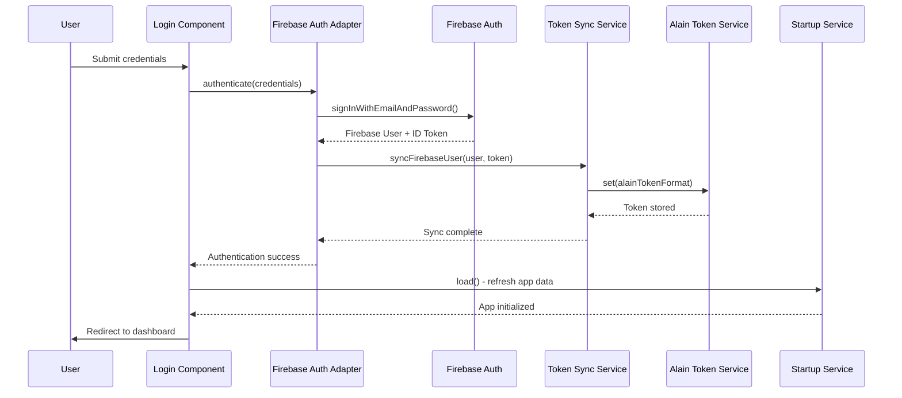

# Design Document

## Overview

This design outlines the integration of Firebase Authentication with the existing ng-alain/delon authentication system. The integration maintains the current ng-alain authentication interface while using Firebase Auth as the underlying authentication provider. The solution ensures seamless operation with existing interceptors, guards, and token management systems while leveraging Firebase's robust authentication capabilities.

The design follows a facade pattern where Firebase Auth serves as the backend authentication provider, and a custom adapter layer synchronizes Firebase authentication state with ng-alain's token service. This approach preserves the existing application architecture while enhancing it with Firebase's authentication features.

## Architecture

### High-Level Architecture

```mermaid
graph TB
    subgraph "Application Layer"
        A[Login Component]
        B[Route Guards]
        C[HTTP Interceptors]
        D[User Components]
    end
    
    subgraph "Integration Layer"
        E[Firebase Auth Adapter]
        F[Token Synchronization Service]
        G[Auth State Manager]
    end
    
    subgraph "ng-alain Layer"
        H[DA_SERVICE_TOKEN]
        I[authSimpleInterceptor]
        J[authSimpleCanActivate]
    end
    
    subgraph "Firebase Layer"
        K[@angular/fire/auth]
        L[Firebase Auth Service]
        M[Firebase ID Tokens]
    end
    
    A --> E
    B --> J
    C --> I
    D --> H
    
    E --> F
    F --> G
    G --> H
    
    E --> K
    F --> L
    G --> M
    
    H --> I
    H --> J
```

### Authentication Flow



## Components and Interfaces

### 1. Firebase Auth Adapter Service

**Purpose**: Primary interface between the application and Firebase Auth, providing ng-alain compatible methods.

**Location**: `src/app/core/auth/firebase-auth-adapter.service.ts`

**Key Responsibilities**:
- Wrap Firebase Auth operations in ng-alain compatible interface
- Handle authentication state changes
- Manage user session lifecycle
- Provide consistent error handling

**Interface**:
```typescript
interface FirebaseAuthAdapter {
  // Authentication methods
  signIn(credentials: LoginCredentials): Promise<AuthResult>
  signOut(): Promise<void>
  
  // State management
  authState$: Observable<User | null>
  isAuthenticated$: Observable<boolean>
  
  // Token management
  getIdToken(forceRefresh?: boolean): Promise<string | null>
  
  // User management
  getCurrentUser(): Promise<User | null>
}
```

### 2. Token Synchronization Service

**Purpose**: Synchronizes Firebase ID tokens with ng-alain's token service format.

**Location**: `src/app/core/auth/token-sync.service.ts`

**Key Responsibilities**:
- Convert Firebase ID tokens to Alain token format
- Handle token refresh scenarios
- Manage token expiration
- Synchronize authentication state

**Interface**:
```typescript
interface TokenSyncService {
  // Synchronization methods
  syncFirebaseToken(firebaseToken: string, user: User): Promise<void>
  clearTokens(): Promise<void>
  
  // Token conversion
  convertToAlainFormat(firebaseToken: string, user: User): AlainToken
  
  // State monitoring
  monitorTokenExpiration(): Observable<boolean>
}
```

### 3. Auth State Manager

**Purpose**: Centralized management of authentication state across Firebase and ng-alain systems.

**Location**: `src/app/core/auth/auth-state-manager.service.ts`

**Key Responsibilities**:
- Monitor Firebase Auth state changes
- Coordinate state synchronization
- Handle authentication events
- Manage session persistence

**Interface**:
```typescript
interface AuthStateManager {
  // State monitoring
  initialize(): Promise<void>
  monitorAuthState(): Observable<AuthState>
  
  // State management
  handleAuthStateChange(user: User | null): Promise<void>
  handleTokenRefresh(token: string): Promise<void>
  
  // Session management
  restoreSession(): Promise<boolean>
  clearSession(): Promise<void>
}
```

### 4. Firebase Token Interceptor

**Purpose**: Enhanced HTTP interceptor that handles Firebase ID token attachment and refresh.

**Location**: `src/app/core/net/firebase-token.interceptor.ts`

**Key Responsibilities**:
- Attach Firebase ID tokens to HTTP requests
- Handle token refresh on 401 responses
- Integrate with existing error handling
- Support concurrent request queuing during refresh

## Data Models

### Authentication Token Format

```typescript
interface AlainFirebaseToken {
  // Standard Alain token fields
  token: string;           // Firebase ID Token
  expired: number;         // Token expiration timestamp
  
  // Firebase-specific fields
  uid: string;            // Firebase user UID
  email?: string;         // User email
  displayName?: string;   // User display name
  photoURL?: string;      // User avatar URL
  
  // Custom claims
  customClaims?: Record<string, any>;
  
  // Refresh token (stored securely)
  refreshToken?: string;
}
```

### Authentication State

```typescript
interface AuthState {
  isAuthenticated: boolean;
  user: User | null;
  token: string | null;
  loading: boolean;
  error: string | null;
}
```

### Login Credentials

```typescript
interface LoginCredentials {
  email: string;
  password: string;
  remember?: boolean;
}

interface AuthResult {
  success: boolean;
  user?: User;
  token?: string;
  error?: string;
}
```

## Error Handling

### Error Categories

1. **Authentication Errors**
   - Invalid credentials
   - User not found
   - Account disabled
   - Email not verified

2. **Token Errors**
   - Token expired
   - Token invalid
   - Refresh failed
   - Network errors

3. **State Synchronization Errors**
   - Sync failure between Firebase and Alain
   - State inconsistency
   - Storage errors

### Error Handling Strategy

```typescript
interface ErrorHandler {
  handleAuthError(error: FirebaseAuthError): Observable<never>
  handleTokenError(error: TokenError): Observable<any>
  handleSyncError(error: SyncError): void
}
```

**Error Mapping**:
- Firebase errors mapped to user-friendly messages
- Integration with existing ng-alain error notification system
- Consistent error handling across all authentication operations

## Testing Strategy

### Unit Testing

1. **Service Testing**
   - Firebase Auth Adapter service methods
   - Token Synchronization service logic
   - Auth State Manager state transitions
   - Error handling scenarios

2. **Integration Testing**
   - Firebase Auth integration
   - Token synchronization flow
   - Interceptor behavior
   - Guard functionality

3. **Component Testing**
   - Login component with Firebase Auth
   - Authentication state display
   - Error message handling

### Test Scenarios

1. **Authentication Flow**
   - Successful login with email/password
   - Failed login with invalid credentials
   - Logout functionality
   - Session restoration on app reload

2. **Token Management**
   - Token refresh on expiration
   - Concurrent request handling during refresh
   - Token synchronization between systems
   - Error handling for failed refresh

3. **State Synchronization**
   - Firebase to Alain state sync
   - Authentication state consistency
   - Session persistence
   - State cleanup on logout

### Testing Tools

- **Unit Tests**: Jasmine/Karma with Firebase Auth mocking
- **Integration Tests**: Firebase Auth Emulator
- **E2E Tests**: Cypress with authentication flows
- **Performance Tests**: Token refresh performance under load

## Implementation Phases

### Phase 1: Core Integration (Week 1-2)
- Implement Firebase Auth Adapter Service
- Create Token Synchronization Service
- Basic authentication flow (login/logout)
- Unit tests for core services

### Phase 2: Advanced Features (Week 2-3)
- Implement Auth State Manager
- Enhanced token refresh mechanism
- Session persistence and restoration
- Integration with existing interceptors

### Phase 3: UI Integration (Week 3-4)
- Update login component for Firebase Auth
- Integrate with existing error handling
- Update user display components
- Comprehensive testing

### Phase 4: Optimization & Polish (Week 4)
- Performance optimization
- Error handling refinement
- Documentation updates
- Final testing and validation

## Security Considerations

### Token Security
- Firebase ID tokens transmitted over HTTPS only
- Secure storage of refresh tokens
- Token expiration handling
- Protection against token replay attacks

### Authentication Security
- Email verification enforcement
- Password strength requirements
- Rate limiting for authentication attempts
- Secure session management

### Data Protection
- Minimal user data storage
- Compliance with privacy regulations
- Secure token transmission
- Protection of sensitive authentication data

## Performance Considerations

### Token Management
- Efficient token caching
- Proactive token refresh
- Minimal API calls for token validation
- Optimized concurrent request handling

### State Synchronization
- Debounced state updates
- Efficient observable chains
- Minimal DOM updates
- Optimized memory usage

### Network Optimization
- Request batching where possible
- Efficient error retry mechanisms
- Optimized payload sizes
- Connection pooling for Firebase requests

## Migration Strategy

### Backward Compatibility
- Existing ng-alain authentication interface preserved
- No breaking changes to existing components
- Gradual migration approach
- Fallback mechanisms for edge cases

### Data Migration
- No existing user data migration required (new Firebase users)
- Existing token format compatibility maintained
- Session data structure preserved
- Configuration migration handled automatically

### Rollback Plan
- Feature flags for Firebase Auth integration
- Ability to disable Firebase Auth and revert to mock auth
- Configuration-based switching
- Minimal impact rollback procedures