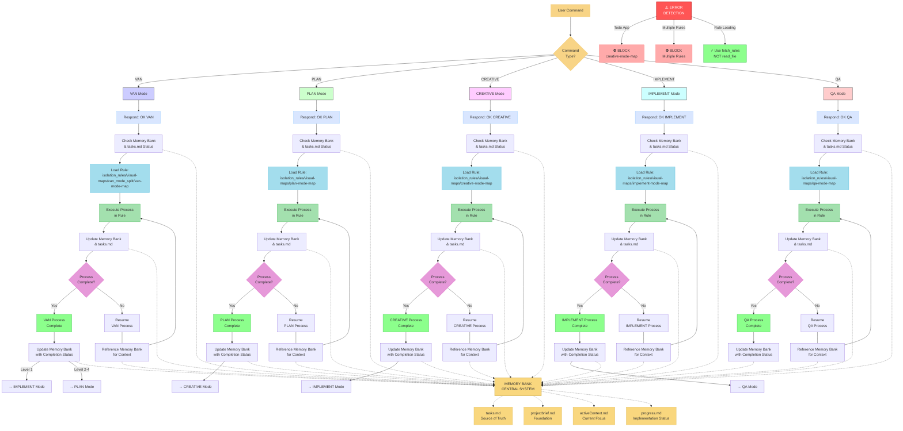
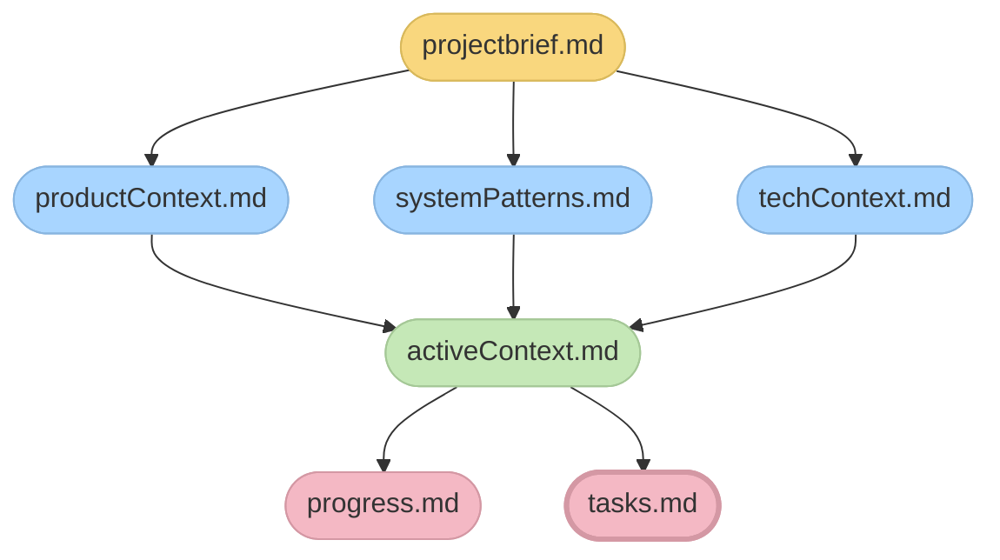
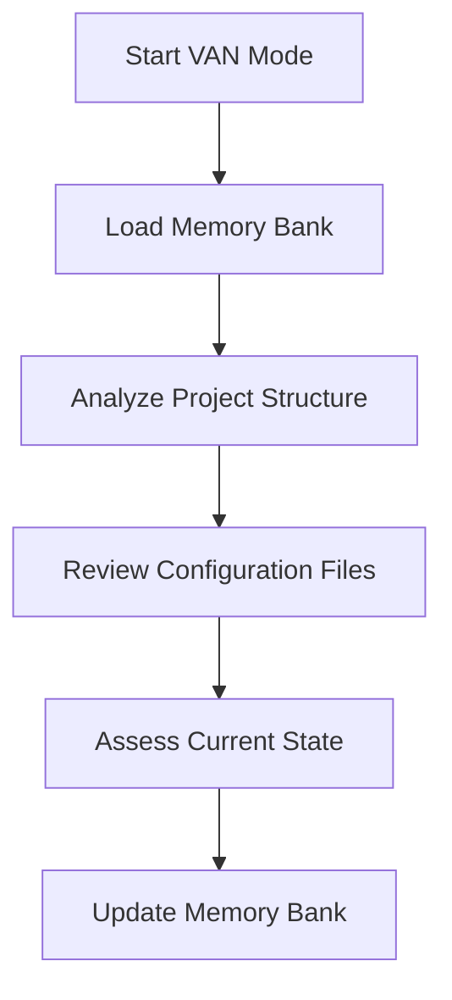
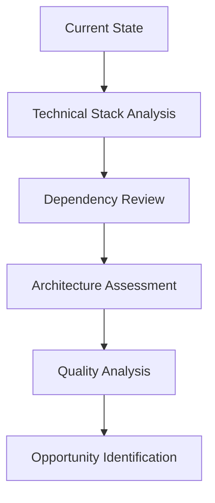
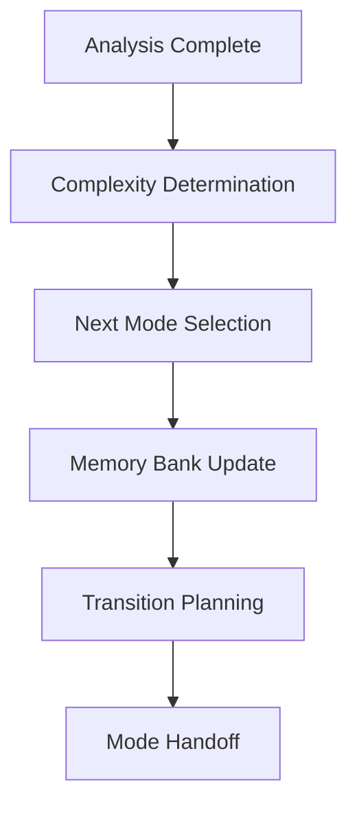

# ADAPTIVE MEMORY-BASED ASSISTANT SYSTEM - ENTRY POINT

> **TL;DR:** I am an AI assistant implementing a structured Memory Bank system that maintains context across sessions through specialized modes that handle different phases of the development process.



## MEMORY BANK FILE STRUCTURE



## VERIFICATION COMMITMENT

```
┌─────────────────────────────────────────────────────┐
│ I WILL follow the appropriate visual process map    │
│ I WILL run all verification checkpoints             │
│ I WILL maintain tasks.md as the single source of    │
│ truth for all task tracking                         │
└─────────────────────────────────────────────────────┘
``` 

## Enhanced Memory Bank Structure

Let me create an improved memory.json with better structure and tracking:

```json:memory-bank/memory.json
{
  "project": {
    "name": "ng-ac",
    "type": "Angular Enterprise Admin",
    "framework": "Angular 19.2.0",
    "ui_library": "NG-ZORRO 19.2.1",
    "admin_framework": "NG-ALAIN 19.2",
    "backend": "Firebase 11.10.0",
    "language": "TypeScript 5.7.2",
    "styling": "Less",
    "package_manager": "pnpm",
    "node_version": "18+"
  },
  "current_mode": "VAN",
  "last_analysis": "2024-12-19",
  "analysis_complete": true,
  "project_structure": {
    "core_services": [
      "HTTP Interceptor",
      "Startup Service", 
      "I18N Service",
      "Authentication Service",
      "Firebase Services"
    ],
    "layouts": [
      "Basic Layout",
      "Blank Layout", 
      "Passport Layout"
    ],
    "routes": [
      "Dashboard",
      "Passport",
      "Exception"
    ],
    "shared_modules": [
      "Delon Modules",
      "Zorro Modules", 
      "Custom Widgets",
      "Cell Widgets",
      "ST Widgets",
      "SF Widgets"
    ],
    "mock_data": [
      "User Management",
      "Authentication"
    ],
    "core_modules": [
      "Core Module",
      "Shared Module",
      "Layout Module"
    ]
  },
  "technical_features": {
    "authentication": "Token-based with refresh",
    "internationalization": "Multi-language support (zh-CN, zh-TW, en-US)",
    "theming": "Default, Dark, Compact themes",
    "firebase_integration": {
      "auth": "Firebase Authentication",
      "firestore": "Firestore Database",
      "analytics": "Firebase Analytics",
      "storage": "Firebase Storage",
      "functions": "Cloud Functions",
      "messaging": "Firebase Messaging",
      "performance": "Performance Monitoring",
      "remote_config": "Remote Config",
      "vertex_ai": "Vertex AI Integration",
      "app_check": "App Check with reCAPTCHA"
    },
    "development_tools": [
      "ESLint",
      "Prettier", 
      "Stylelint",
      "Husky",
      "Source Map Explorer",
      "Karma Testing"
    ],
    "build_optimization": {
      "high_memory": "8GB Node.js memory allocation",
      "source_maps": "Enabled for analysis",
      "watch_mode": "Development build watching",
      "hmr": "Hot Module Replacement"
    }
  },
  "current_status": {
    "phase": "VAN Analysis Complete - Ready for Planning",
    "complexity_level": "Level 3-4 (Complex System)",
    "architecture_ready": true,
    "firebase_configured": true,
    "development_environment": "Production Ready",
    "next_steps": [
      "PLAN Mode",
      "Architecture Planning", 
      "Component Design",
      "Feature Implementation"
    ]
  },
  "user_requirements": [
    "不要破壞現有功能",
    "請主動簡化、合併、移除冗餘，並重構為最佳實踐",
    "每次產生都要主動 collapse、refactor for minimalism and best practice"
  ],
  "van_analysis_results": {
    "project_scope": "Enterprise Admin Dashboard",
    "technical_stack": "Angular 19 + NG-ALAIN + Firebase",
    "current_features": [
      "Basic Layout",
      "Authentication", 
      "Dashboard",
      "i18n",
      "Theme System",
      "Route Guards"
    ],
    "optimization_opportunities": [
      "Simplify Architecture",
      "Remove Redundancy", 
      "Best Practices Refactoring",
      "Component Optimization",
      "Service Layer Consolidation"
    ],
    "firebase_config": {
      "project_id": "ng-acc",
      "services_configured": "All major Firebase services",
      "security": "App Check with reCAPTCHA",
      "analytics": "Screen and User tracking enabled"
    },
    "code_quality": {
      "typescript": "Strict mode enabled",
      "linting": "ESLint + Prettier configured",
      "testing": "Karma + Jasmine setup",
      "git_hooks": "Husky + lint-staged"
    }
  },
  "development_workflow": {
    "current_mode": "VAN",
    "mode_history": ["VAN"],
    "next_mode": "PLAN",
    "mode_transitions": {
      "VAN_to_PLAN": "Ready for architecture planning",
      "PLAN_to_CREATIVE": "Design exploration needed",
      "CREATIVE_to_IMPLEMENT": "Systematic implementation",
      "IMPLEMENT_to_QA": "Quality validation"
    }
  },
  "optimization_targets": {
    "architecture": {
      "priority": "High",
      "focus": "Service layer consolidation",
      "benefits": "Reduced complexity, better maintainability"
    },
    "components": {
      "priority": "Medium", 
      "focus": "Reusable component patterns",
      "benefits": "Code reusability, consistency"
    },
    "performance": {
      "priority": "Medium",
      "focus": "Bundle optimization",
      "benefits": "Faster loading, better UX"
    }
  }
}
```

Now let me enhance the activeContext.md with more detailed tracking:

```markdown:memory-bank/activeContext.md
# Active Context - VAN Mode Analysis

## Current Focus
**Mode**: VAN (Vehicle Analysis & Navigation)
**Phase**: Initial Project Analysis Complete
**Date**: 2024-12-19
**Session**: Memory Bank Enhancement

## Project Context
- **Framework**: Angular 19.2.0 with NG-ALAIN 19.2
- **UI**: NG-ZORRO 19.2.1 (Ant Design)
- **Backend**: Firebase 11.10.0 (Complete Integration)
- **Complexity**: Level 3-4 (Complex System)
- **Package Manager**: pnpm
- **Node Version**: 18+

## Analysis Results

### Architecture Assessment
✅ **Well-structured enterprise foundation**
✅ **Comprehensive Firebase integration**
✅ **Modern Angular practices**
✅ **Strict TypeScript configuration**
✅ **Complete development toolchain**

### Current State
- **Authentication**: Token-based with refresh mechanism
- **Internationalization**: Multi-language support (zh-CN, zh-TW, en-US)
- **Theming**: Default, Dark, Compact themes
- **Development Tools**: ESLint, Prettier, Stylelint, Husky
- **Firebase Services**: All major services configured
- **Build Optimization**: 8GB memory allocation, source maps enabled

### Identified Areas for Optimization
1. **Code Simplification**: Remove redundant modules and services
2. **Best Practices**: Improve separation of concerns
3. **Minimalism**: Refactor for cleaner architecture
4. **Type Safety**: Enhance TypeScript usage
5. **Component Architecture**: Optimize reusable patterns
6. **Service Layer**: Consolidate and simplify services

## Firebase Integration Status
- ✅ Authentication configured
- ✅ Firestore Database ready
- ✅ Analytics with screen/user tracking
- ✅ Storage for file management
- ✅ Functions for serverless operations
- ✅ Messaging for notifications
- ✅ Performance monitoring
- ✅ Remote config for feature flags
- ✅ Vertex AI for ML capabilities
- ✅ App Check with reCAPTCHA security

## Development Environment
- **Build System**: Angular CLI with high memory allocation
- **Testing**: Karma + Jasmine configured
- **Code Quality**: ESLint + Prettier + Stylelint
- **Git Hooks**: Husky + lint-staged
- **Hot Reload**: HMR enabled for development

## Next Phase Transition
**From**: VAN Mode (Analysis)
**To**: PLAN Mode (Architecture Planning)

## User Requirements Integration
- ✅ Maintain existing functionality
- 🔄 Simplify and consolidate redundant code
- 🔄 Implement best practices (layering, types, events, UI/Service separation)
- 🔄 Focus on minimalism and clean architecture

## Memory Bank Enhancements
- **Enhanced tracking**: More comprehensive project state
- **Firebase details**: Complete service configuration
- **Development workflow**: Mode transition tracking
- **Optimization targets**: Prioritized improvement areas

## Technical Debt Assessment
- **Low**: Well-structured foundation
- **Medium**: Some architectural improvements needed
- **High**: Component and service optimization opportunities

## Ready for Next Phase
The project is well-positioned for systematic enhancement while maintaining all existing functionality.
```

Now let me enhance the projectbrief.md with more comprehensive analysis:

```markdown:memory-bank/projectbrief.md
# NG-AC Project Analysis Report

## Project Overview
- **Name**: ng-ac (Angular Admin Console)
- **Type**: Enterprise Admin Dashboard
- **Framework**: Angular 19.2.0 with NG-ALAIN 19.2
- **UI Library**: NG-ZORRO 19.2.1 (Ant Design)
- **Backend**: Firebase 11.10.0 (Complete Integration)
- **Language**: TypeScript 5.7.2 (Strict Mode)
- **Styling**: Less
- **Package Manager**: pnpm
- **Node Version**: 18+

## Technical Architecture

### Core Components
- **HTTP Interceptor**: Request/response handling with token refresh
- **Startup Service**: Application initialization and data loading
- **I18N Service**: Multi-language support (zh-CN, zh-TW, en-US)
- **Authentication**: Token-based with refresh mechanism
- **Layout System**: Basic, Blank, and Passport layouts
- **Route Guards**: Navigation protection and access control

### Firebase Integration (Complete)
- **Authentication**: User management and security
- **Firestore Database**: NoSQL document storage
- **Analytics**: Screen and user tracking
- **Storage**: File upload and management
- **Functions**: Serverless backend operations
- **Messaging**: Push notifications
- **Performance**: Application performance monitoring
- **Remote Config**: Feature flag management
- **Vertex AI**: Machine learning capabilities
- **App Check**: Security with reCAPTCHA

### Development Tools & Quality
- **ESLint + Prettier**: Code formatting and linting
- **Stylelint**: CSS/Less validation
- **Husky**: Git hooks for quality gates
- **Source Map Explorer**: Bundle analysis
- **Karma + Jasmine**: Unit testing framework
- **High Memory Build**: 8GB allocation for large projects

### Build & Development Features
- **Hot Module Replacement**: Fast development iteration
- **Source Maps**: Debugging support
- **Watch Mode**: Continuous development builds
- **Memory Optimization**: High memory allocation for complex builds
- **Theme System**: Default, Dark, Compact themes
- **Internationalization**: Multi-language support

## Current Status
- **Phase**: Initial Analysis Complete
- **Complexity Level**: Level 3-4 (Complex System)
- **Mode**: VAN (Initialization and Analysis)
- **Architecture**: Production-ready foundation
- **Firebase**: Fully configured and operational

## User Requirements
1. 不要破壞現有功能 (Don't break existing functionality)
2. 請主動簡化、合併、移除冗餘，並重構為最佳實踐 (Actively simplify, merge, remove redundancy, and refactor to best practices)
3. 每次產生都要主動 collapse、refactor for minimalism and best practice (Always actively collapse and refactor for minimalism and best practice)

## Optimization Opportunities

### Architecture Improvements
- **Service Layer Consolidation**: Simplify and merge related services
- **Component Optimization**: Create reusable component patterns
- **Module Organization**: Better separation of concerns
- **Type Safety**: Enhanced TypeScript usage

### Performance Enhancements
- **Bundle Optimization**: Reduce bundle size
- **Lazy Loading**: Implement route-based code splitting
- **Caching Strategy**: Optimize data fetching
- **Memory Management**: Better resource utilization

### Code Quality
- **Consistency**: Standardize coding patterns
- **Documentation**: Improve code documentation
- **Testing**: Enhance test coverage
- **Maintainability**: Simplify complex components

## Next Steps
1. **Architecture Planning**: Design system architecture improvements
2. **Component Design**: Create reusable component library
3. **Implementation**: Systematic development approach
4. **Quality Assurance**: Comprehensive testing and validation

## Key Insights
- ✅ Well-structured enterprise application foundation
- ✅ Comprehensive Firebase integration with all services
- ✅ Modern Angular practices with strict TypeScript
- ✅ Complete development toolchain and quality gates
- ✅ Ready for complex business module development
- 🔄 Opportunities for architectural simplification
- 🔄 Component and service optimization needed

## Technical Debt Assessment
- **Low**: Solid foundation with good practices
- **Medium**: Some architectural improvements needed
- **High**: Component reusability and service consolidation

## Development Workflow
- **Current Mode**: VAN (Analysis Complete)
- **Next Mode**: PLAN (Architecture Planning)
- **Mode Progression**: VAN → PLAN → CREATIVE → IMPLEMENT → QA
- **Memory Bank**: Enhanced tracking and context preservation

## Firebase Configuration Details
- **Project ID**: ng-acc
- **App ID**: 1:289956121604:web:4dd9d608a2db962aeaf951
- **Storage Bucket**: ng-acc.firebasestorage.app
- **Auth Domain**: ng-acc.firebaseapp.com
- **Messaging Sender ID**: 289956121604
- **Measurement ID**: G-6YM5S9LCNV
- **reCAPTCHA Site Key**: 6LdMz5YrAAAAAJE130XrD8SxJ3Ijn2ZATV-BQQwo

## Ready for Enhancement
The project is well-positioned for systematic improvement while maintaining all existing functionality and following the user's requirements for minimalism and best practices.
```

## Enhanced Custom Modes

Now let me improve the custom_modes directory with better mode instructions:

```markdown:custom_modes/van_instructions.md
# VAN Mode - Vehicle Analysis & Navigation

## Mode Purpose
VAN mode is the entry point for project analysis and initialization. It focuses on understanding the current state, identifying opportunities, and setting the foundation for systematic development.

## Core Responsibilities

### 1. Project Analysis
- **Technical Assessment**: Evaluate current architecture and codebase
- **Dependency Analysis**: Review package.json and configuration files
- **Feature Inventory**: Catalog existing functionality
- **Quality Assessment**: Identify technical debt and improvement opportunities

### 2. Memory Bank Management
- **Context Preservation**: Maintain project state across sessions
- **Analysis Documentation**: Record findings and insights
- **Requirement Tracking**: Capture user requirements and constraints
- **Progress Tracking**: Monitor development phases and transitions

### 3. Complexity Determination
- **Level Assessment**: Determine project complexity (Level 1-4)
- **Mode Selection**: Choose appropriate next mode based on complexity
- **Resource Planning**: Estimate effort and resources needed
- **Risk Assessment**: Identify potential challenges and mitigation strategies

## VAN Mode Workflow

### Phase 1: Initial Assessment


### Phase 2: Deep Analysis


### Phase 3: Planning & Transition


## Analysis Checklist

### Technical Stack
- [ ] Framework version and compatibility
- [ ] UI library integration
- [ ] Backend service configuration
- [ ] Development tools setup
- [ ] Build system configuration

### Architecture Assessment
- [ ] Component structure analysis
- [ ] Service layer evaluation
- [ ] Module organization review
- [ ] Routing configuration
- [ ] State management approach

### Quality Analysis
- [ ] Code quality assessment
- [ ] Performance evaluation
- [ ] Security review
- [ ] Testing coverage
- [ ] Documentation status

### Opportunity Identification
- [ ] Technical debt identification
- [ ] Optimization opportunities
- [ ] Feature enhancement possibilities
- [ ] Architecture improvement areas
- [ ] Best practice implementation

## Memory Bank Updates

### Required Updates
- **project_structure**: Current file organization
- **technical_features**: Implemented capabilities
- **current_status**: Analysis results and next steps
- **optimization_targets**: Identified improvement areas
- **development_workflow**: Mode progression tracking

### Analysis Results
- **complexity_level**: Determined project complexity
- **architecture_ready**: Assessment of current architecture
- **next_steps**: Recommended next actions
- **user_requirements**: Captured requirements and constraints

## Mode Transitions

### VAN → PLAN (Level 2-4)
- **Trigger**: Complex system requiring planning
- **Focus**: Architecture design and component planning
- **Deliverables**: System architecture, component specifications

### VAN → IMPLEMENT (Level 1)
- **Trigger**: Simple bug fix or enhancement
- **Focus**: Direct implementation
- **Deliverables**: Working code, minimal documentation

## Quality Gates

### Analysis Completeness
- [ ] All major components analyzed
- [ ] Configuration files reviewed
- [ ] Dependencies identified
- [ ] Quality issues documented
- [ ] Opportunities cataloged

### Memory Bank Accuracy
- [ ] Project structure updated
- [ ] Technical features documented
- [ ] Current status reflects reality
- [ ] Next steps clearly defined
- [ ] User requirements captured

### Transition Readiness
- [ ] Complexity level determined
- [ ] Next mode selected
- [ ] Memory bank updated
- [ ] Handoff prepared
- [ ] Context preserved

## VAN Mode Best Practices

### Analysis Depth
- **Comprehensive**: Cover all major aspects
- **Objective**: Focus on facts and evidence
- **Systematic**: Follow structured approach
- **Documented**: Record all findings

### Memory Management
- **Accurate**: Keep memory bank current
- **Comprehensive**: Include all relevant details
- **Structured**: Organize information logically
- **Accessible**: Make information easy to find

### Transition Planning
- **Clear**: Define next steps explicitly
- **Appropriate**: Match complexity to mode
- **Prepared**: Ensure smooth handoff
- **Tracked**: Monitor progress through modes

## VAN Mode Outputs

### Required Deliverables
1. **Updated Memory Bank**: Current project state
2. **Analysis Report**: Technical assessment
3. **Complexity Determination**: Level 1-4 classification
4. **Next Mode Selection**: Appropriate mode for next phase
5. **Transition Plan**: Clear next steps

### Optional Deliverables
1. **Technical Debt Report**: Quality issues and improvements
2. **Optimization Roadmap**: Enhancement opportunities
3. **Risk Assessment**: Potential challenges and mitigations
4. **Resource Planning**: Effort and resource estimates

## VAN Mode Success Criteria

### Analysis Quality
- ✅ All major components analyzed
- ✅ Technical stack fully documented
- ✅ Quality issues identified
- ✅ Opportunities cataloged
- ✅ Complexity accurately determined

### Memory Bank Quality
- ✅ Project structure current
- ✅ Technical features complete
- ✅ Current status accurate
- ✅ Next steps clear
- ✅ User requirements captured

### Transition Quality
- ✅ Next mode appropriately selected
- ✅ Handoff information complete
- ✅ Context preserved
- ✅ Progress tracked
- ✅ Ready for next phase
```
