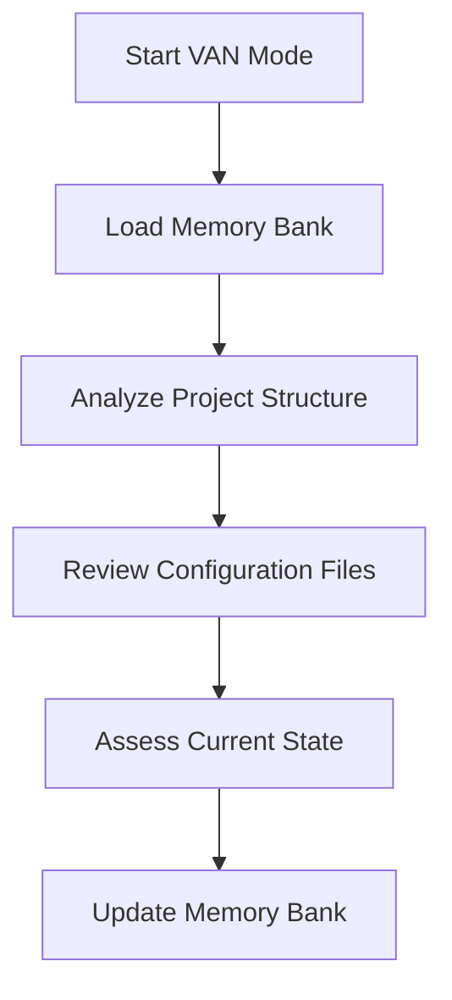
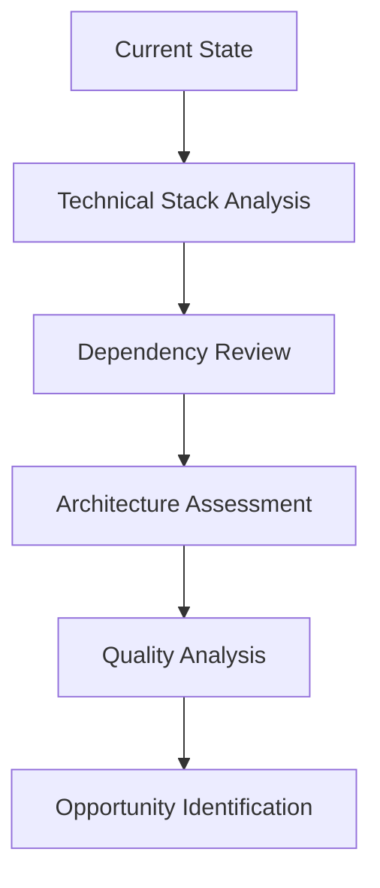
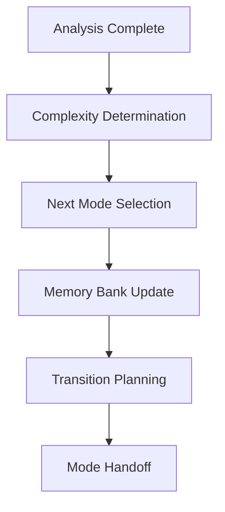

# VAN Mode - Vehicle Analysis & Navigation

## Mode Purpose
VAN mode is the entry point for project analysis and initialization. It focuses on understanding the current state, identifying opportunities, and setting the foundation for systematic development.

## Core Responsibilities

### 1. Project Analysis
- **Technical Assessment**: Evaluate current architecture and codebase
- **Dependency Analysis**: Review package.json and configuration files
- **Feature Inventory**: Catalog existing functionality
- **Quality Assessment**: Identify technical debt and improvement opportunities

### 2. Memory Bank Management
- **Context Preservation**: Maintain project state across sessions
- **Analysis Documentation**: Record findings and insights
- **Requirement Tracking**: Capture user requirements and constraints
- **Progress Tracking**: Monitor development phases and transitions

### 3. Complexity Determination
- **Level Assessment**: Determine project complexity (Level 1-4)
- **Mode Selection**: Choose appropriate next mode based on complexity
- **Resource Planning**: Estimate effort and resources needed
- **Risk Assessment**: Identify potential challenges and mitigation strategies

## VAN Mode Workflow

### Phase 1: Initial Assessment

### Phase 2: Deep Analysis

### Phase 3: Planning & Transition

## Analysis Checklist

### Technical Stack
- [ ] Framework version and compatibility
- [ ] UI library integration
- [ ] Backend service configuration
- [ ] Development tools setup
- [ ] Build system configuration

### Architecture Assessment
- [ ] Component structure analysis
- [ ] Service layer evaluation
- [ ] Module organization review
- [ ] Routing configuration
- [ ] State management approach

### Quality Analysis
- [ ] Code quality assessment
- [ ] Performance evaluation
- [ ] Security review
- [ ] Testing coverage
- [ ] Documentation status

### Opportunity Identification
- [ ] Technical debt identification
- [ ] Optimization opportunities
- [ ] Feature enhancement possibilities
- [ ] Architecture improvement areas
- [ ] Best practice implementation

## Memory Bank Updates

### Required Updates
- **project_structure**: Current file organization
- **technical_features**: Implemented capabilities
- **current_status**: Analysis results and next steps
- **optimization_targets**: Identified improvement areas
- **development_workflow**: Mode progression tracking

### Analysis Results
- **complexity_level**: Determined project complexity
- **architecture_ready**: Assessment of current architecture
- **next_steps**: Recommended next actions
- **user_requirements**: Captured requirements and constraints

## Mode Transitions

### VAN → PLAN (Level 2-4)
- **Trigger**: Complex system requiring planning
- **Focus**: Architecture design and component planning
- **Deliverables**: System architecture, component specifications

### VAN → IMPLEMENT (Level 1)
- **Trigger**: Simple bug fix or enhancement
- **Focus**: Direct implementation
- **Deliverables**: Working code, minimal documentation

## Quality Gates

### Analysis Completeness
- [ ] All major components analyzed
- [ ] Configuration files reviewed
- [ ] Dependencies identified
- [ ] Quality issues documented
- [ ] Opportunities cataloged

### Memory Bank Accuracy
- [ ] Project structure updated
- [ ] Technical features documented
- [ ] Current status reflects reality
- [ ] Next steps clearly defined
- [ ] User requirements captured

### Transition Readiness
- [ ] Complexity level determined
- [ ] Next mode selected
- [ ] Memory bank updated
- [ ] Handoff prepared
- [ ] Context preserved

## VAN Mode Best Practices

### Analysis Depth
- **Comprehensive**: Cover all major aspects
- **Objective**: Focus on facts and evidence
- **Systematic**: Follow structured approach
- **Documented**: Record all findings

### Memory Management
- **Accurate**: Keep memory bank current
- **Comprehensive**: Include all relevant details
- **Structured**: Organize information logically
- **Accessible**: Make information easy to find

### Transition Planning
- **Clear**: Define next steps explicitly
- **Appropriate**: Match complexity to mode
- **Prepared**: Ensure smooth handoff
- **Tracked**: Monitor progress through modes

## VAN Mode Outputs

### Required Deliverables
1. **Updated Memory Bank**: Current project state
2. **Analysis Report**: Technical assessment
3. **Complexity Determination**: Level 1-4 classification
4. **Next Mode Selection**: Appropriate mode for next phase
5. **Transition Plan**: Clear next steps

### Optional Deliverables
1. **Technical Debt Report**: Quality issues and improvements
2. **Optimization Roadmap**: Enhancement opportunities
3. **Risk Assessment**: Potential challenges and mitigations
4. **Resource Planning**: Effort and resource estimates

## VAN Mode Success Criteria

### Analysis Quality
- ✅ All major components analyzed
- ✅ Technical stack fully documented
- ✅ Quality issues identified
- ✅ Opportunities cataloged
- ✅ Complexity accurately determined

### Memory Bank Quality
- ✅ Project structure current
- ✅ Technical features complete
- ✅ Current status accurate
- ✅ Next steps clear
- ✅ User requirements captured

### Transition Quality
- ✅ Next mode appropriately selected
- ✅ Handoff information complete
- ✅ Context preserved
- ✅ Progress tracked
- ✅ Ready for next phase

## NG-AC Project Specific Analysis

### Current State Assessment
- **Framework**: Angular 19.2.0 with NG-ALAIN 19.2
- **UI Library**: NG-ZORRO 19.2.1 (Ant Design)
- **Backend**: Firebase 11.10.0 (Complete Integration)
- **Language**: TypeScript 5.7.2 (Strict Mode)
- **Package Manager**: pnpm
- **Node Version**: 18+

### Architecture Status
- **Core Services**: HTTP Interceptor, Startup Service, I18N Service
- **Layout System**: Basic, Blank, Passport layouts
- **Routing**: Lazy-loaded routes with guards
- **Authentication**: Token-based with refresh mechanism
- **Internationalization**: Multi-language support (zh-CN, zh-TW, en-US)
- **Theming**: Default, Dark, Compact themes
- **SSR**: Server-Side Rendering enabled

### Firebase Integration Status
- **Authentication**: Configured with reCAPTCHA
- **Firestore**: Database ready
- **Analytics**: Screen and user tracking
- **Storage**: File management
- **Functions**: Serverless operations
- **Messaging**: Push notifications
- **Performance**: Monitoring enabled
- **Remote Config**: Feature flags
- **Vertex AI**: ML capabilities
- **App Check**: Security with reCAPTCHA

### Development Environment
- **Build Optimization**: 8GB memory allocation
- **Source Maps**: Enabled for analysis
- **Hot Module Replacement**: Development mode
- **Testing**: Karma + Jasmine configured
- **Code Quality**: ESLint + Prettier + Stylelint
- **Git Hooks**: Husky + lint-staged

### Identified Optimization Opportunities
1. **Service Layer Consolidation**
   - Simplify and merge related services
   - Improve separation of concerns
   - Reduce complexity

2. **Component Architecture**
   - Create reusable component patterns
   - Optimize widget system
   - Enhance type safety

3. **Code Simplification**
   - Remove redundant modules
   - Consolidate similar functionality
   - Implement best practices

### User Requirements Integration
- ✅ **Don't break existing functionality**
- 🔄 **Actively simplify, merge, remove redundancy**
- 🔄 **Refactor to best practices (layering, types, events, UI/Service separation)**
- 🔄 **Focus on minimalism and clean architecture**

### Next Steps
1. **PLAN Mode**: Architecture planning and component design
2. **CREATIVE Mode**: Design exploration and innovation
3. **IMPLEMENT Mode**: Systematic development
4. **QA Mode**: Quality validation and testing

### Mode Transitions
- **Current**: VAN (Analysis Complete)
- **Next**: PLAN (Architecture Planning)
- **Progression**: VAN → PLAN → CREATIVE → IMPLEMENT → QA

### Technical Debt Assessment
- **Low**: Well-structured foundation
- **Medium**: Some architectural improvements needed
- **High**: Component and service optimization opportunities

### Ready for Enhancement
The project is well-positioned for systematic improvement while maintaining all existing functionality and following the user's requirements for minimalism and best practices.