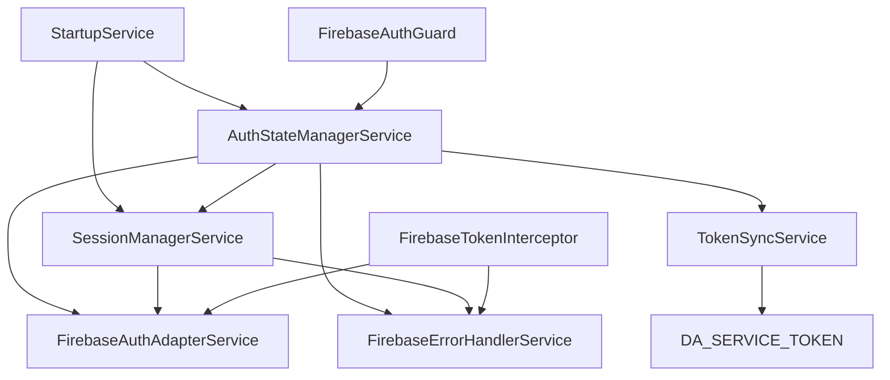

# Firebase Auth 整合模組

## 概述

這個模組提供了 Firebase Authentication 與 ng-alain/delon 認證系統的完整整合。遵循精簡主義原則，僅包含必要功能，並保持與現有 ng-alain 結構的完全相容性。

## 核心服務

### 1. FirebaseAuthAdapterService
- **用途**: Firebase Auth 的主要適配器
- **功能**: 提供與 ng-alain 相容的 Firebase 認證介面
- **位置**: `firebase-auth-adapter.service.ts`

### 2. TokenSyncService
- **用途**: 同步 Firebase ID tokens 與 Alain token 格式
- **功能**: 處理 token 轉換、儲存和過期管理
- **位置**: `token-sync.service.ts`

### 3. AuthStateManagerService
- **用途**: 統一認證狀態管理
- **功能**: 協調 Firebase Auth 和 ng-alain 認證狀態
- **位置**: `auth-state-manager.service.ts`

### 4. SessionManagerService
- **用途**: 會話持久化管理
- **功能**: 處理會話保存、恢復和驗證
- **位置**: `session-manager.service.ts`

### 5. FirebaseErrorHandlerService
- **用途**: Firebase 錯誤處理
- **功能**: 將 Firebase 錯誤映射為用戶友好的訊息
- **位置**: `firebase-error-handler.service.ts`

## HTTP 攔截器

### FirebaseTokenInterceptor
- **用途**: 自動附加 Firebase ID tokens 到 HTTP 請求
- **功能**: 處理 token 刷新和併發請求
- **位置**: `firebase-token.interceptor.ts`

## 路由守衛

### FirebaseAuthGuard
- **用途**: 基於 Firebase Auth 狀態的路由保護
- **功能**: 與現有 ng-alain 守衛整合
- **位置**: `firebase-auth.guard.ts`

## 配置和提供者

### provideFirebaseAuthIntegration()
- **用途**: 提供所有 Firebase Auth 整合服務
- **位置**: `firebase-auth.providers.ts`
- **使用**: 在 `app.config.ts` 中調用

```typescript
export const appConfig: ApplicationConfig = {
  providers: [
    ...providers,
    ...firebaseProviders,
    ...provideFirebaseAuthIntegration()
  ]
};
```

## 應用程式配置

### Firebase 配置
Firebase 配置現在從環境變數中讀取：

```typescript
// environment.ts
export const environment = {
  // ... 其他配置
  firebase: {
    projectId: "your-project-id",
    appId: "your-app-id",
    storageBucket: "your-storage-bucket",
    apiKey: "your-api-key",
    authDomain: "your-auth-domain",
    messagingSenderId: "your-sender-id",
    measurementId: "your-measurement-id"
  }
};
```

### HTTP 攔截器順序
攔截器按以下順序配置：
1. 環境特定攔截器 (如 mockInterceptor)
2. `firebaseTokenInterceptor` - 附加 Firebase tokens
3. `authSimpleInterceptor` - ng-alain 認證攔截器
4. `defaultInterceptor` - 預設錯誤處理

## 啟動流程整合

### StartupService 整合
應用程式啟動時會自動：
1. 嘗試恢復 Firebase Auth 會話
2. 如果會話有效，初始化認證狀態管理器
3. 同步 Firebase 狀態與 ng-alain token 服務
4. 繼續正常的應用程式初始化流程

```typescript
load(): Observable<void> {
  return this.sessionManager.restoreSession().pipe(
    switchMap((sessionRestored) => {
      if (sessionRestored) {
        return this.authStateManager.initialize().pipe(
          switchMap(() => this.viaMockI18n()),
          catchError(() => this.viaMockI18n())
        );
      } else {
        return this.viaMockI18n();
      }
    }),
    catchError(() => this.viaMockI18n())
  );
}
```

## 服務依賴關係



## 類型定義

### AuthState
```typescript
interface AuthState {
  isAuthenticated: boolean;
  user: User | null;
  token: string | null;
  loading: boolean;
  error: string | null;
}
```

### SessionData
```typescript
interface SessionData {
  uid: string;
  email?: string;
  displayName?: string;
  photoURL?: string;
  lastActivity: number;
  sessionId: string;
  version: string;
  createdAt: number;
  deviceInfo?: string;
}
```

## 測試

### 單元測試
每個服務都有對應的單元測試：
- `firebase-auth-adapter.service.spec.ts`
- `token-sync.service.spec.ts`
- `auth-state-manager.service.spec.ts`
- `session-manager.service.spec.ts`
- `firebase-error-handler.service.spec.ts`

### 整合測試
- `auth-integration.spec.ts` - 服務整合測試
- `session-persistence.integration.spec.ts` - 會話持久化測試

### 配置測試
- `app.config.spec.ts` - 應用程式配置測試

## 使用範例

### 基本認證流程
```typescript
// 登入
this.firebaseAuth.signIn(email, password).subscribe(user => {
  // 認證成功，狀態會自動同步
});

// 登出
this.authStateManager.clearSession().subscribe(() => {
  // 登出完成，重定向到登入頁面
});

// 檢查認證狀態
this.authStateManager.isAuthenticated$.subscribe(isAuth => {
  if (isAuth) {
    // 用戶已認證
  }
});
```

### 會話管理
```typescript
// 手動更新會話活動
this.sessionManager.updateActivity().subscribe();

// 驗證會話
this.sessionManager.validateSession().subscribe(isValid => {
  if (!isValid) {
    // 會話無效，需要重新登入
  }
});

// 清理過期會話
this.sessionManager.cleanupExpiredSessions().subscribe();
```

## 最佳實踐

1. **不要直接操作 localStorage 中的會話資料**
2. **使用 AuthStateManagerService 來檢查認證狀態**
3. **讓 TokenSyncService 自動處理 token 同步**
4. **依賴 FirebaseTokenInterceptor 自動附加 tokens**
5. **使用 FirebaseErrorHandlerService 處理錯誤**

## 故障排除

### 常見問題

1. **Token 未自動附加到請求**
   - 檢查 `firebaseTokenInterceptor` 是否在攔截器鏈中
   - 確認用戶已認證且有有效 token

2. **會話無法恢復**
   - 檢查 localStorage 中的會話資料
   - 確認設備資訊一致性
   - 檢查會話是否過期

3. **認證狀態不同步**
   - 確認 `AuthStateManagerService` 已正確初始化
   - 檢查 Firebase Auth 狀態變化是否被監聽

4. **服務注入錯誤**
   - 確認 `provideFirebaseAuthIntegration()` 已在 `app.config.ts` 中調用
   - 檢查服務依賴關係是否正確

### 調試工具

1. **會話資訊**
   ```typescript
   const sessionInfo = this.sessionManager.getCurrentSessionInfo();
   console.log('Current session:', sessionInfo);
   ```

2. **認證狀態**
   ```typescript
   const authState = this.authStateManager.getCurrentState();
   console.log('Auth state:', authState);
   ```

3. **Firebase Auth 狀態**
   ```typescript
   this.firebaseAuth.authState$.subscribe(user => {
     console.log('Firebase user:', user);
   });
   ```